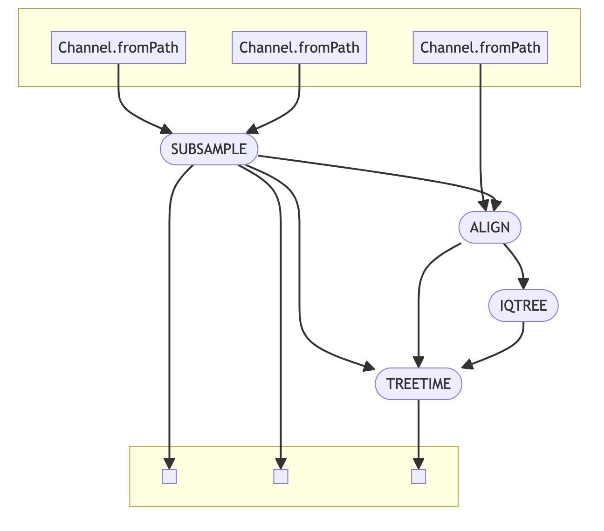

**#DENV_Phylo**

##Introduction

DENV_Phylo is a bioinformtics pipeline that runs using nextfow. The pipeline is used to perform phylogenetic analysis of Dengue data from [GISAID](https://gisaid.org/). 

##Installation

Install docker as decribed [here](https://www.docker.com/)

clone the github repo:
```bash
git clone https://github.com/arnoldlambisia/DENV_Phylo.git
```

##Pipeline



The pipeline has four key processes:

1. Data cleanup using ([r-base](https://www.r-project.org/))

>This step uses an [R script](bin/data_cleanup_subset.R) that takes inputs of a [fasta](data/gisaid_test.fasta) and a [metadata](data/gisaid_test.tsv) file downloaded from gisaid. The output is a renamed fasta file, subsampled accession IDs and fasta file and a metadata file for use with treetime.

2. Alignment of subsampled fasta sequences using [nextalign](https://github.com/neherlab/nextalign)

> The [reference](references/DENV1_ref.fasta) used is NC_001477 polyprotein for Dengue 1.

3. Maximum likelihood tree genration using [iqtree](http://www.iqtree.org)

>parameters used:
    -m TEST
    -bb 1000
    -T 4

4. Creation of a time resolved tree using [treetime](https://github.com/neherlab/treetime)


###Usage
```bash
docker run --rm -it -v \
<change directory to cloned repo>:$(pwd) alambisia/phylogen:1.0 nextflow run $(pwd)/main.nf \
--gisaid_fasta <insert fasta> \
--gisaid_metadata <insert metadata>
```

**Contributed by**:
```
+Arnold Lambisia
+Sam Odoyo
+Chimwemwe Mhango
+Evalyne Nyambura
+Daniel Omoding
```
